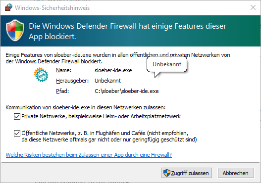
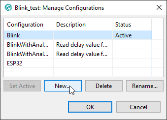
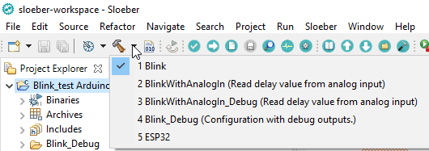
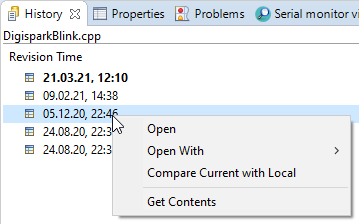

# Sloeber Tutorial

This introduction is copied from: http://eclipse.baeyens.it/learn.shtml

The arduino IDE put the focus on "a low entry level". Honestly with decades of experience in software development I can tell you -hand on heart- that the Arduino IDE is very good designed ... for it's purpose.

But when you start growing and "the low entry level" is no longer your first concern. You start to want a "rich tool", not a "this way it will work always work tool". So a tool that allows you to control more things, and as such does not stop you from breaking things.

As it is nearly impossible to combine a "rich tool" with a "low entry level tool" many "requests for improvements" are rejected by the arduino core team as it may infringe the "low entry level" target.

So when you have a need that goes above "low entry level" you are out of the focus of the arduino IDE development team and you need to start banging another door/tool.

At that point in time, one of the doors/options is the arduino eclipse plugin. One of the strong points of the Arduino eclipse plugin compared to the other available tools is that it is multi platform. It has active users using Windows, Mac and linux.

The arduino eclipse plugin is easy to set-up (though harder than the Arduino IDE) and easy to use. It has the same icons for verifying upload and serial monitor as the arduino IDE. And to name the biggest plus: It supports you to serve your multiple projects with different configurations (of each project). And it supports you from writing your code up to hopping into code of included libraries – seamless.

Most people have uploaded their first sketch in Slouber in less than 30 minutes - there are some people who never succeeded in running the tool – with this introduction we firmly believe that you belong to the first group. Good luck and have fun with this impressive extension!

# Table of contents

- [Table of contents](#table-of-contents)
- [Installation](#installation)
  - [Setting Paths](#setting-paths)
  - [First start of Sloeber](#first-start-of-sloeber)
  - [Eclipse IDE with Sloeber extensions](#eclipse-ide-with-sloeber-extensions)
- [First Project Blink on Arduino UNO](#first-project-blink-on-arduino-uno)
  - [Create a new project: Blink-test for Arduino UNO](#create-a-new-project-blink-test-for-arduino-uno)
    - [Suppress sloeber.ini.cpp](#suppress-sloeberinicpp)
    - [Add line numbers to the editor](#add-line-numbers-to-the-editor)
    - [Change Compile options and Compile summary format](#change-compile-options-and-compile-summary-format)
    - [Upload to Arduino UNO](#upload-to-arduino-uno)
    - [Enable automatic build before upload](#enable-automatic-build-before-upload)
    - [Changing the Com Port for uploading](#changing-the-com-port-for-uploading)
    - [Where are the compiled results?](#where-are-the-compiled-results)
- [Discovering the Arduino cores](#discovering-the-arduino-cores)
- [Manage Debug and Release version in one project (Multiple configurations)](#manage-debug-and-release-version-in-one-project-multiple-configurations)
  - [Extend Menu with Active Build Configuration and Build Active Configuration buttons.](#extend-menu-with-active-build-configuration-and-build-active-configuration-buttons)
  - [Set indexer settings for multiple configurations](#set-indexer-settings-for-multiple-configurations)
  - [Rename an existing configuration](#rename-an-existing-configuration)
  - [Add Debug configuration for the project](#add-debug-configuration-for-the-project)
    - [Set up the Debug configuration](#set-up-the-debug-configuration)
- [Two different sources in the same project](#two-different-sources-in-the-same-project)
  - [Add a new configuration for the new source](#add-a-new-configuration-for-the-new-source)
  - [Assign the sources to the respective configurations](#assign-the-sources-to-the-respective-configurations)
  - [Choose which configuration to build](#choose-which-configuration-to-build)
- [Change platform to ESP32](#change-platform-to-esp32)
  - [Install ESP platform](#install-esp-platform)
    - [Extend Third party index url's](#extend-third-party-index-urls)
    - [Choose the ESP core version](#choose-the-esp-core-version)
    - [Select the ESP32 board for my project](#select-the-esp32-board-for-my-project)
- [Useful Settings](#useful-settings)
  - [Auto Format 132 character per line](#auto-format-132-character-per-line)
  - [Enable file history](#enable-file-history)
    - [Access the history of a file](#access-the-history-of-a-file)
  - [Launch explorer for the current file](#launch-explorer-for-the-current-file)
  - [Create a launch configuration for external tool](#create-a-launch-configuration-for-external-tool)
- [Advanced features](#advanced-features)
  - [Advanced Editing shortcuts](#advanced-editing-shortcuts)
  - [Explore the history of your code](#explore-the-history-of-your-code)
  - [Generating Assembler output of your program](#generating-assembler-output-of-your-program)
  - [Synchronize editor window with left tree view](#synchronize-editor-window-with-left-tree-view)
  - [Add user libraries](#add-user-libraries)
  - [Create a function from multiple lines of code](#create-a-function-from-multiple-lines-of-code)
  - [Convert an ino file to a cpp file](#convert-an-ino-file-to-a-cpp-file)
- [Working sets](#working-sets)
- [Tips and Tricks](#tips-and-tricks)
  - [Detach an editor perspective (e.g. Console) window](#detach-an-editor-perspective-eg-console-window)
  - [Full screen Editing](#full-screen-editing)
- [Errors and Problems](#errors-and-problems)
  - [A Window (e.g. Console) was accidentally deleted, the window arrangement is broken](#a-window-eg-console-was-accidentally-deleted-the-window-arrangement-is-broken)
  - [Errors in unknown libraries](#errors-in-unknown-libraries)
  - [Strange errors indicated, F3 does not work, index not complete](#strange-errors-indicated-f3-does-not-work-index-not-complete)
  - [No build.opt](#no-build-opt)
  - [Keyboard layout changed to English/US](#keyboard-layout-changed-to-englishus)
  - [Error message: invalid argument to --format: avr](#error-message-invalid-argument-to---format-avr)
- [Software updates](#software-updates)

# Installation

## Setting Paths

In windows environment, choose an install path with a short name e.g. **C:\Sloeber**. Otherwise, while installation, some path names will be longer than accepted under Windows.

Create empty directory as workspace C:\sloeber-workspace

Start **sloeber-ide.exe**, select the new workspace and check "Use this…"

## First start of Sloeber

Since you do not have secure data, you may allow for public sites.

Close the welcome tab.

Wait while sloeber is loading the current core and libraries

## Eclipse IDE with Sloeber extensions

This is the Eclipse window with the Sloeber extensions as well as *two extra buttons you will add in a few seconds!*  

# First Project Blink on Arduino UNO

## Create a new project: Blink-test for Arduino UNO

Here we choose a sample sketch as start for our project.

This is the Sloeber/Eclipse window for the Source file **Blink.uno**.

On the right, you see the **Outline window**, with all variables and functions listed for quick access.

In the middle, there are the **edit windows.**

Left is the **Project Explorer** with the tree view of your projects and files.

On the Bottom, there are some **Views** like the **Console** and **Serial monitor view**.

### Suppress sloeber.ini.cpp

We think that the presence of the file “sloeber.ini.cpp” is a crutch. How to get rid of it? Just rename “Blink.ino” into “Blink.cpp” and the sloeber.ini.cpp file will vanish.

**Note: If you do so, you must add the line \#include \<Arduino.h\> in your source.**

### Add line numbers to the editor

Open **Window \> Preferences  
**

Search for line and check **Insert spaces for tabs** and **Show line numbers**  

### Change Compile options and Compile summary format

Open Project properties with **Alt + Enter**  

Check **use alternative size command? (AVR only)  
Do not check it for any non AVR platform!  
**

### Upload to Arduino UNO

### Enable automatic build before upload

To be sure, that your upload includes all your recent changes, you should enable **Save automatically before manual build option** in **Window \> Preferences \> General \> Workspace \> Build.**

### Changing the Com Port for uploading

You must set the Com Port in the **Arduino properties** of your project to the port number of your Arduino board, which is displayed in the **Windows Device Manager**. **You most likely have to attach the Board**, before selecting the port, because only Com-Ports currently attached can be selected.

### Where are the compiled results?

The **Blink_test.hex** file is the file used by uploading with avrdude.exe

You can remove the Release folder and other build folders anytime. Sloeber will restore them at the next build.

# Discovering the Arduino cores

If you place the cursor over an Arduino (or library) function, it shows you the sourcecode.  

If you press **F3**, the function definition will open in a new editor window. If you activate the **Link with Editor** button, the **Project Explorer** window shows you all core files.  
You can even modify the core sources, but be careful!

# Manage Debug and Release version in one project (Multiple configurations)

Each project has individual settings, like Board/CPU (type/clock), libraries, clock speed, Com Port, or Sources used for compile.  
To have 2 different settings, you can of course create 2 projects, but then you have to take care to keep the sources synchronized .  
With configurations, you can have different sets of settings for one source. Each configuration is available at one mouse click.

## Extend Menu with Active Build Configuration and Build Active Configuration buttons.

First, we extend the menu to have **two useful buttons** available for configuration management.

Check **Build Configuration** on the **Action Set Availability** tab to enable the **Active Build Configuration** and **Build Active Configuration** buttons.  

Save the changes to the current perspective in order to have it persistent even after a reset perspective. We simply overwrite the existent Arduino perspective.  

## Set indexer settings for multiple configurations

The index for **active build configuration** should be enabled. This allows for more advanced usage of configuration, like binding different libraries etc.

Open this with **Window > Preferences**.

## Rename an existing configuration

## Add Debug configuration for the project
You can open the `Manage Configuration` window also by **Project > Build Configuration > Manage**.

We can now change easily to the Debug configuration  

### Set up the Debug configuration

Now we change the Debug configuration to have the **DEBUG** macro defined. This is equivalent to including the line **\#define DEBUG** in your code. To have it specified in our configuration allows fast switching between using or not using the define without changing the code.

Switching back to the Release configuration shows that the **DEBUG** guarded statements are inactive now.

##### The code for the example:

*void setup() {*

*// initialize digital pin LED_BUILTIN as an output.*

*pinMode(LED_BUILTIN, OUTPUT);*

*// Just to know which program is running on my Arduino*

*\#ifdef DEBUG*

*Serial.println(F("START " \_\_FILE\_\_ " from " \_\_DATE\_\_));*

*\#endif*

*}*

*// the loop function runs over and over again forever*

*void loop() {*

*\#ifdef DEBUG*

*Serial.println("Activate LED");*

*\#endif*

*digitalWrite(LED_BUILTIN, HIGH); // turn the LED on (HIGH is the voltage level)*

*delay(1000); // wait for a second*

*\#ifdef DEBUG*

*Serial.println("Deactivate LED");*

*\#endif*

*digitalWrite(LED_BUILTIN, LOW); // turn the LED off by making the voltage LOW*

*delay(1000); // wait for a second*

*}*

# Two different sources in the same project

Next, we add an additional source file with an extended version of our blink example.

Without a new configuration, we get the multiple definition of \`setup' Error on compile.  

### Add a new configuration for the new source

And yet another for the *Debug* **variant for the new source.**  
Here we just copy the settings from the existent Debug configuration, so the **–DDEBUG** is already set on creation  
.

### Assign the sources to the respective configurations

In Eclipse, all project sources (and libraries) are assigned to all configurations by default.  
For each source, you must therefore specify all the configurations where this source should be excluded. Here we exclude the old file **Blink.cpp** from the new configurations.

The "same" must be done for the new source file.

### Choose which configuration to build.
This can be done in two ways.

# Change platform to ESP32

## Install ESP platform

Open **Arduino \> Preferences  
.**

### Extend Third party index url's

Add https://raw.githubusercontent.com/espressif/arduino-esp32/gh-pages/package_esp32_index.json

### Choose the ESP core version

Open **Arduino \> Preferences** again and choose the desired version in Platform and Boards. You can choose multiple versions, which can be used for different configurations or projects. 

Here you find the unofficial list of all known core / board URL's

<https://github.com/arduino/Arduino/wiki/Unofficial-list-of-3rd-party-boards-support-urls>

A few more common URL's:

- http://arduino.esp8266.com/stable/package_esp8266com_index.json

- https://raw.githubusercontent.com/espressif/arduino-esp32/gh-pages/package_esp32_index.json

- https://github.com/stm32duino/BoardManagerFiles/raw/master/STM32/package_stm_index.json

- http://dan.drown.org/stm32duino/package_STM32duino_index.json

- https://raw.githubusercontent.com/sparkfun/Arduino_Apollo3/master/package_sparkfun_apollo3_index.json

- https://files.pololu.com/arduino/package_pololu_index.json

- http://drazzy.com/package_drazzy.com_index.json

- https://raw.githubusercontent.com/ArminJo/DigistumpArduino/master/package_digistump_index.json

- http://raw.githubusercontent.com/MHEtLive/arduino-boards-index/master/package_mhetlive_index.json

- https://sandeepmistry.github.io/arduino-nRF5/package_nRF5_boards_index.json

- https://mcudude.github.io/MiniCore/package_MCUdude_MiniCore_index.json

- https://raw.githubusercontent.com/xukangmin/TinyCore/master/avr/package/package_tinycore_index.json

- https://mcudude.github.io/MegaCore/package_MCUdude_MegaCore_index.json

### Select the ESP32 board for my project

One **drawback of Sloeber** is, that the default settings are not filled in. But they can easily be determined, if you select the same board in the **Arduino IDE**.

# Useful Settings

## Auto Format 132 character per line

The standard auto format settings are the **Kernighan & Ritchie style** with a **maximum line length of 80** characters. If you feel that this is too short for your HD Monitor (like I do), set maximum line length to e.g. 132.

Open **Window \> Preferences  
**

Navigate to the **C++ Formatter**, click on **New….** and give it a sensible name.  

Then change **Maximum line width** on the **Line Wrapping** tab to 132.  

## Enable file history

By default, the file history is limited to 7 days.  

I personally prefer an unlimited history, it does not take too much space on your disk (2.6 GB for 136 projects and 5 years).  

### Access the history of a file

The local history (stored on your computer) can be accessed by selecting a file and them **Team \> Show Local History**  

This is an example history.

## Launch explorer for the current file

This opens a Windows explorer window located at the file currently selected in the edit window. It is very handy if you want to modify or copy the file outside of Sloeber.

## Create a launch configuration for external tool

You can also create a launch configuration for external tool, to have this function available at one click.

Add the path **C:\Windows\explorer.exe** and add **Arguments** "/select,\${resource_loc}"**  
**

On the Build tab, uncheck the **Build before launch** checkbox  

On the Common tab, check **External Tools**  

Run it from the menu  

# Advanced features

## Advanced Editing shortcuts

- Search definition of a variable/function with `F3`
- Search Usage of variable/function with `Ctrl + Shift + G`
- Rename variable/function/macro at all occurrences with `Alt + Shift + R`
- Format source with `Ctrl + Shift + F`
- Comment/Outcomment with `Ctrl + Shift + /`
- Search (and replace) in Project or complete Workspace with `Search \> File …`

### Name completion with Ctrl + Space

Here the completion for "Seria".  

It handles also available functions of an object if pressed after the dot.  

### Creating code blocks with Ctrl + Space

Type "sw", press Ctrl + Space and select **switch case statement**. A complete switch template will be generated for you.

Type "for", press Ctrl + Space and you get:

This results in:

**for** (**int** var = 0; var \< <u>max</u>; ++var) {

}

## Explore the history of your code

In the History view you can not only display historical file contents, but also compare them with current content.

If you select two dates / lines in the history view, you can compare them with each other.

## Generating Assembler output of your program

Open **Project \> Properties \> C/C++ Build \> Settings \> Build Steps** and add "avr-objdump -h -S \${BuildArtifactFileBaseName}.elf \> \${BuildArtifactFileBaseName}.lss" in the field **Post-build steps \> Command**

The assembler output is located in Blink/Blink_test.lss and looks like:

## Synchronize editor window with left tree view

If you activate the "Link with Editor" button. The tree view will position at the file in the Editor window (which is not always desirable).

## Add user libraries

You can specify the location where your manually managed libraries are located.  

## Create a function from multiple lines of code

First, select the lines of code you want to have as a function, then use **Refactor \> Extract Function** and specify name of the function as well as other parameters. The function will then be created and inserted before the current function.  

## Convert an ino file to a cpp file

If you create a project from an Arduino example or download Arduino examples, you always have an \*.ino file as main program.

If you just rename your \*.ino file to \*.cpp, you will get compiler errors. You must **first** include the lines

**\#include** "Arduino.h"

**void** **<u>setup</u>**() ;

**void** **<u>loop</u>**() ;

**void** **<u>calibrate</u>**() ;

from the file *sloeber.ino.cpp* into the \*.ino file before any \#defines or declarations. After renaming your file, the file file sloeber.ino.cpp will be deleted (and if you rename it back, it is created again ).

# Working sets

If after a while you have many projects in your workspace, you can group them with working sets.  
Here I grouped all projects with the same core into a working set and used the project configuration for the different source files/examples  

# Tips and Tricks

## Detach an editor perspective (e.g. Console) window

You can detach every window by just dragging it elsewhere.  
Dragging back can be done by simply **clicking on the tab (not on the title of the detached tab window)**. Then you will see mouse cursor change showing you where you can drop it to attach the tab back to Eclipse. Alternatively, you can close the window and use **Window \> Perspective \> Reset Perspective**.

## Full screen Editing

By double clicking on the tab of every window, this window changes to full screen / full window. The next double click reverts this change.

# Errors and Problems
Before you chase a strange error, it is always recommended to try **Sloeber > Reattach Libraries**,  **right mouse button > Clean Project** and **Index > Rebuild** and to close and open the project or even restart Sloeber.
Also look to the list of libraries with **Sloeber > Add a library to the selected project** and check, if it corresponds to your requirements.

## A Window (e.g. Console) was accidentally deleted, the window arrangement is broken

Reset window arrangement with **Window \> Perspective \> Reset Perspective**.  
**Do NEVER check** the box **Also discard perspective's customization**.

## Errors in unknown libraries

If you get errors like

`make: \*\*\* \[libraries\FreeRTOS\src\croutine.c.o\] Error 1`

then check libraries, sometimes there are more libraries than required. In this case, Sloeber thinks you might need the FreeRTOS library for the project.

Simply delete it in the Project Explorer or exclude it from your configuration.

## Strange errors indicated, F3 does not work, index not complete

This happens sometimes after changing configuration.  
Run **Index \> Rebuild** or **Index \> Freshen All Files** and the strange behavior will vanish.

## No build.opt

If you get errors like

`ESP8266/core/build.opt: No such file or directory`

then just removing the line `build.opt.flags="@{build.opt.fqfn}"` in the files platform.txt and platform.sloeber.txt and restarting Sloeber will fix it. 
"Build options" can be specified in the **Compile Options** tab in the Sloeber project settings.

The files can be found at e.g. Sloeber\arduinoPlugin\packages\esp8266\hardware\esp8266\3.1.1\.

## Keyboard layout changed to English/US

Keyboard layout can be (accidentally) changed by **Alt + Shift** to English and back.

## Error message: invalid argument to --format: avr

You accidentally selected `AVR_ALTERNATIVE` for **use alternative size command?**

Do not select it for any non AVR platform!

**

#  Software updates

Check for updates with **Help \> Check for Updates**

You see a list of available updates

Then you will be asked to **accept the terms of the license agreements**

And because the package is of course not signed, you must choose **Install anyway**

At last restart Sloeber

